# Primitive

Primitive is the product-neutral Go primitive layer used to build reliable
command-line tools and services.

Module: `github.com/deliri/primitive/v2026`

First release: `v2026.0.0`

Primitive is a clean rebuild with no compatibility obligation to the archived
implementation. It makes Go's standard library, operating-system primitives,
documented protocols, and official SDKs typed, validated, bounded, streaming,
and easier to compose. The real substrate still does the work.

- [LEDGER.md](LEDGER.md) owns project state.
- [\_docs/testing_protocol.md](_docs/testing_protocol.md) owns test doctrine.
- [\_docs/interviews/](_docs/interviews/) preserves the recon evidence.

## Import flow

An arrow `A --> B` means A must directly import and semantically use B. Every
unshown Primitive sibling import is forbidden. The typed architecture catalog
is executable authority for every landed package's production imports. This
diagram is its public human-readable projection.

```mermaid
flowchart TD
    core[core]

    attest[attest] --> core
    contextstate[contextstate] --> core
    currency[currency] --> core
    garble[garble] --> core
    keygen[keygen] --> core
    testserial[testserial] --> core

    filelock[filelock] --> core
    filelock --> contextstate
    filestore[filestore] --> core
    filestore --> contextstate
    filestore --> temporal
    hostfacts[hostfacts] --> core
    hostfacts --> contextstate
    temporal[temporal] --> core
    temporal --> contextstate

    exchange[exchange] --> core
    exchange --> contextstate
    exchange --> keygen
    exchange --> temporal
    fuzzfinder[fuzzfinder] --> core
    fuzzfinder --> filestore
    id[id] --> core
    id --> temporal
    lease[lease] --> core
    lease --> temporal
    lease --> attest
    gate[gate] --> core
    gate --> lease
    receipt[receipt] --> core
    receipt --> attest
    receipt --> temporal
    controlwire[controlwire] --> core
    controlwire --> keygen
    controlwire --> exchange
    controlwire --> temporal
    controlplane[controlplane] --> core
    controlplane --> controlwire
    controlplane --> attest
    controlplane --> lease
    controlplane --> temporal
    controlplane --> receipt
    submission[submission] --> core
    submission --> attest
    submission --> controlwire
    submission --> objectstore
    submission --> temporal
    submissionauth[submissionauth] --> core
    submissionauth --> attest
    submissionauth --> controlplane
    submissionauth --> submission
    controlplanetest[controlplanetest] --> core
    controlplanetest --> controlplane
    controlplanetest --> controlwire
    controlplanetest --> lease
    controlplanetest --> receipt
    controlplanetest --> temporal
    process[process] --> core
    process --> contextstate
    process --> temporal
    release[release] --> core
    release --> temporal
    release --> attest
    release --> garble
    release --> process
    shutdown[shutdown] --> core
    shutdown --> contextstate
    shutdown --> temporal

    objectstore[objectstore] --> core
    objectstore --> contextstate
    objectstore --> temporal
    objectstore --> exchange
    timeproof[timeproof] --> core
    timeproof --> temporal
    timeproof --> keygen
    cloudidentity[cloudidentity] --> core
    cloudidentity --> temporal
    cloudidentity --> exchange

    deploy[deploy] --> core
    deploy --> objectstore
    deploy --> release

    upgrade[upgrade] --> core
    upgrade --> filestore
    upgrade --> hostfacts
    upgrade --> objectstore
    upgrade --> release
    upgrade --> temporal

    gcsobjects[gcsobjects] --> core
    gcsobjects --> contextstate
    gcsobjects --> temporal
    gcsobjects --> objectstore
```

The diagram is the production graph. A package may additionally declare
test-only edges in the same compiler-owned catalog when its real ingress value
cannot be constructed without the package that produces it. A declared test
edge grants no production dependency, counts against the same per-package
coupling ceiling, and is rejected when no test source uses it. `gate` uses
`attest` and `temporal` to prove real signed leases, `submissionauth` uses
`controlplanetest` and `controlwire` to prove real credentialed requests,
`process` uses
`testserial` for process-wide isolation, and `deploy` uses `attest`, `exchange`,
and `temporal` to prove a real authenticated manifest and transfer substrate.

## License

Primitive is licensed under the [Mozilla Public License 2.0](LICENSE).

Copyright 2026 Deliri Software Inc., operating as Off Grid Software.
